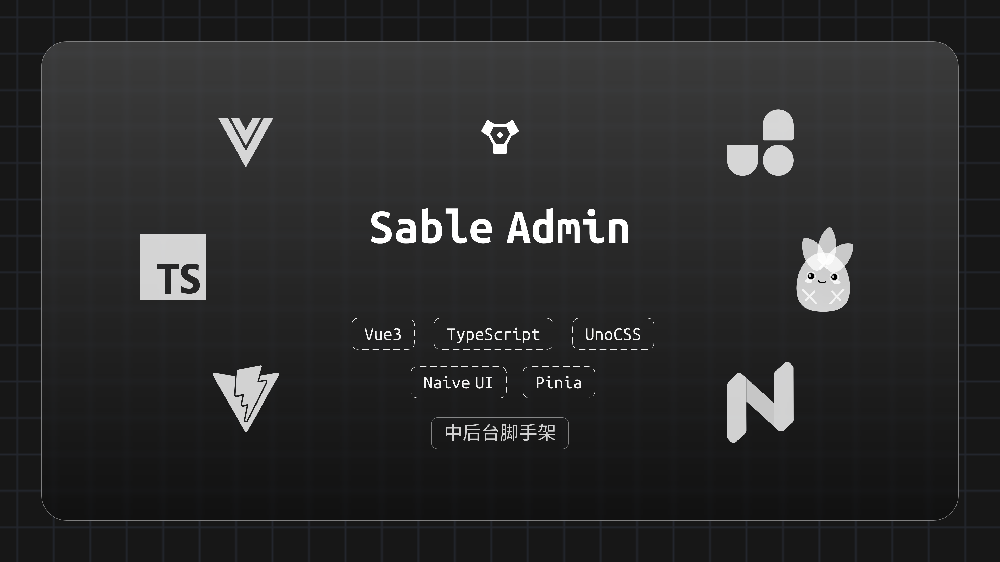

# sable
[](https://github.com/antfu/eslint-config)



近日来，总觉所学甚少，所知甚少。写这项目，一来是验证和学习新的知识，二来是对自己内心的一次探寻。

> 后台管理系统

这是一套完备的后台管理系统，使用技术：

- UI 组件库：`Navie UI`
- http 请求：`axios`
- 路由切换： `Vue Router`
- 全局状态管理： `Pinia`
- css： `unocss` & `scss`
- 工具函数：`lodash` & `vueuse`
- 等

  > 详细文档查看 https://www.whbbit.cn/wiki/sable/index.html 【正在编写中】

## 项目配置文件

项目配置部分暂定存放于 `config` 文件中

## 插件部分

依赖的第三方插件的配置文件存放于 plugins 文件夹中，方便后期管理

## 公共工具函数

工具函数都存放于 utils 文件夹中

## 视图部分

- 视图文件存放于 views 文件夹中
- 布局文件存放于 layouts 文件夹中

## 路由部分

### 自动注册路由配置文件

放置于`router/modules`中的路由配置文件会被自动加载至路由中

### 外链功能

可以跳转至外部链接，路由部分书写规范

```ts
import { RouteRecordRaw } from 'vue-router'
import Blank from '@/layouts/blank.vue'

export default {
  path: '',
  component: () => import('@/layouts/default/index.vue'),
  name: 'links',
  meta: { menu: { title: '外链', order: 99, showParentMenu: false, icon: 'ion:link' }, type: 'layout' },
  children: [
    {
      name: 'whbit',
      path: 'https://whbbit.cn',
      component: Blank,
      meta: { menu: { title: 'whbbit主页' } },
    },
    {
      name: 'vue',
      path: 'https://cn.vuejs.org/',
      component: Blank,
      meta: { menu: { title: 'vue官网', icon: 'logos:vue' } },
    },
  ],
} as RouteRecordRaw
```

## TODO
主题
鹤 红、白、黑
虎 橙、白、黑
竹 绿、白、黑
